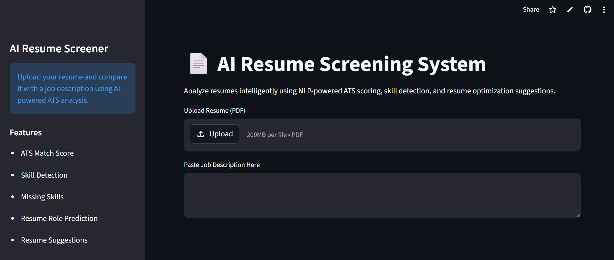

# 📄 AI Resume Screening System

<div align="center">

### AI-Powered ATS Resume Analyzer using NLP, RAG & Semantic Intelligence

Analyze resumes intelligently using NLP-powered ATS scoring, semantic similarity, RAG retrieval, skill extraction, role prediction, and resume optimization recommendations.

---


</div>

---

# 🔗 Project Links

[](https://github.com/Adr005/AI-Resume-Screener)

[](PASTE_YOUR_STREAMLIT_LINK_HERE)

---

# 🚀 Features

## 📊 ATS Match Score Analysis
- Calculates a highly accurate and balanced ATS compatibility score.
- Uses a **Hybrid Scoring Model** combining semantic cosine similarity (via `SentenceTransformers`) with keyword skill-matching ratios.

---

## 🤖 RAG Resume Analysis
- Chunks resume text and stores embeddings in a **FAISS vector index**.
- Retrieves the top-3 most semantically relevant resume sections for any given job description using **cosine similarity over normalised inner-product search**.

---

## 🛠 Skill Extraction Engine
- Dynamically extracts skills using robust letter-boundary regex patterns and **alias matching** (e.g. `sklearn` → `scikit-learn`, `nodejs` → `node.js`).
- Supports **85+ technical, analytical, DevOps, design, and PM tools** (preventing false substring positives and fully supporting versioned tools like `HTML5`, `CSS3`, `Python3`).

---

## ❌ Missing Skills Detection
- Identifies important job-relevant skills absent from the resume.
- Helps candidates optimize resumes for ATS systems.

---

## 🧠 Resume Role Prediction
Predicts suitable technical roles such as:
- Machine Learning Engineer
- Data Scientist
- Data Analyst
- Full Stack Developer
- Software Engineer

based on detected skills.

---

## 📌 Resume Improvement Suggestions
Generates intelligent, **JD-aware** recommendations — suggestions are driven by skills actually required in the job description, not a fixed hardcoded list.

---

# 🖥️ Dashboard Preview

The dashboard provides:

- ATS Score Visualization
- RAG-based Resume Intelligence (top relevant sections)
- Resume Skill Analytics
- Missing Skills Dashboard
- Resume Intelligence Recommendations
- Role Prediction Engine
- Interactive Resume Analysis UI

---

# 🛠️ Tech Stack

| Technology | Purpose |
|---|---|
| Python | Backend Logic |
| Streamlit | Interactive Web Application |
| SentenceTransformers (`all-MiniLM-L6-v2`) | Semantic Embedding Generation |
| FAISS (`IndexFlatIP`) | Vector Similarity Search (RAG retrieval) |
| Scikit-learn | Cosine Similarity Scoring |
| LangChain Text Splitter | Resume Chunking for RAG |
| Regex (Lookaround boundaries) | Precision Skill Extraction |
| pdfplumber | Resume Parsing |

---

# 📂 Project Structure

```bash
AI-Resume-Screener/
│
├── app.py
├── requirements.txt
├── README.md
├── .gitignore
└── venv/
```

---

# 🧭 System Architecture

```text
                ┌─────────────────────┐
                │ Resume PDF Upload   │
                └─────────┬───────────┘
                          │
                          ▼
                ┌─────────────────────┐
                │ PDF Text Extraction │
                │    (pdfplumber)     │
                └─────────┬───────────┘
                          │
                          ▼
                ┌─────────────────────┐
                │ Job Description     │
                │ Input Processing    │
                └─────────┬───────────┘
                          │
                          ▼
                ┌─────────────────────┐
                │ SentenceTransformer │
                │ Embedding Model     │
                └──────┬──────────────┘
                       │
          ┌────────────┴────────────┐
          ▼                         ▼
┌─────────────────────┐   ┌─────────────────────┐
│ FAISS Vector Index  │   │  Cosine Similarity  │
│ (RAG Retrieval)     │   │  (ATS Score)        │
└─────────┬───────────┘   └──────────┬──────────┘
          │                          │
          ▼                          ▼
┌─────────────────────┐   ┌──────────────────────┐
│ Top-3 Relevant      │   │  Hybrid ATS Score    │
│ Resume Sections     │   │  Engine (40/60 mix)  │
└─────────────────────┘   └──────────┬───────────┘
                                     │
               ┌─────────────────────┼────────────────────┐
               ▼                     ▼                     ▼
      ┌─────────────┐    ┌────────────────┐    ┌─────────────────┐
      │ Skill       │    │ Missing Skills │    │ Role Prediction │
      │ Detection   │    │ Detection      │    │ Engine          │
      │ + Aliases   │    │ (JD-driven)    │    │                 │
      └──────┬──────┘    └───────┬────────┘    └────────┬────────┘
             │                   │                      │
             └───────────────────┼──────────────────────┘
                                 ▼
                       ┌─────────────────────┐
                       │ Resume Suggestions  │
                       │ & Dashboard Output  │
                       └─────────────────────┘
```

---

# ⚙️ Workflow

## Step 1 — Resume Upload
User uploads resume PDF and enters target job description. If the PDF yields no extractable text (e.g. scanned/image-based), the system raises an early warning and stops gracefully.

---

## Step 2 — Resume Parsing
Text is extracted from PDF using `pdfplumber`.

---

## Step 3 — Embedding & RAG Indexing
The resume is chunked using `LangChain RecursiveCharacterTextSplitter`. Each chunk is embedded via `SentenceTransformer (all-MiniLM-L6-v2)` and stored in a **FAISS `IndexFlatIP`** vector index with L2-normalised vectors, enabling true cosine similarity retrieval.

---

## Step 4 — ATS Analysis
A hybrid algorithm combines semantic cosine similarity (40% weight) with keyword skill match ratio (60% weight) to calculate the final compatibility score.

---

## Step 5 — Resume Intelligence
The system:
- retrieves the top-3 most relevant resume sections via RAG,
- extracts technical skills using robust letter-boundary regex with alias support,
- identifies missing skills required by the JD,
- predicts technical role,
- generates JD-aware improvement suggestions.

---

# ✨ Core Functionalities

| Functionality | Description |
|---|---|
| ATS Scoring | Hybrid score combining semantic cosine similarity (40%) and skill match ratio (60%) |
| RAG Retrieval | FAISS IndexFlatIP + normalised embeddings for top-3 relevant resume sections |
| Skill Extraction | Word-boundary + alias scan covering 85+ standard tools |
| Missing Skills Analysis | Detects absent required skills from the JD |
| Role Prediction | Predicts technical domain from detected skills |
| Resume Suggestions | JD-driven resume improvement guidance |
| Dashboard UI | Interactive analytics interface |

---

# 🎨 UI Features

- Wide responsive dashboard layout
- Sidebar navigation panel
- Two-column analytics interface
- Interactive progress indicators
- Intelligent recommendation sections
- Professional Streamlit styling

---

# ▶️ Run Locally

```bash
pip install -r requirements.txt
streamlit run app.py
```

---

# 🌐 Live Demo
https://ai-resume-screener-himnznnruqezneyi6vzmaz.streamlit.app/
Launch the deployed Streamlit application using the badge above.

---
# 📸 Screenshots

## Dashboard Preview



---

# 🔮 Future Improvements

- Transformer-based re-ranking of RAG results
- Resume ranking system
- Multi-resume comparison
- Recruiter analytics dashboard
- LLM-powered resume optimization
- AI-generated interview preparation
- Semantic skill matching
- Resume scoring analytics

---

# 👨‍💻 Author

### Aadhya Rohatgi

B.Tech Data Science Student  
AI • ML • NLP • Data Science